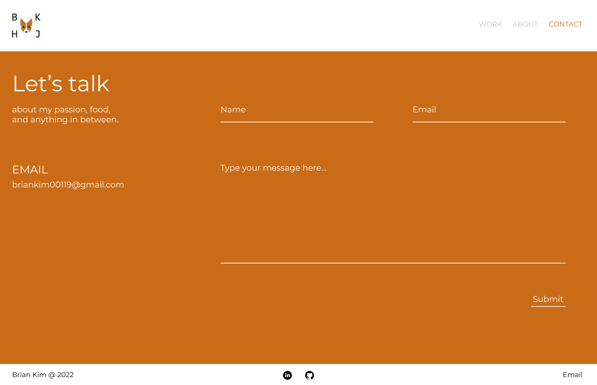
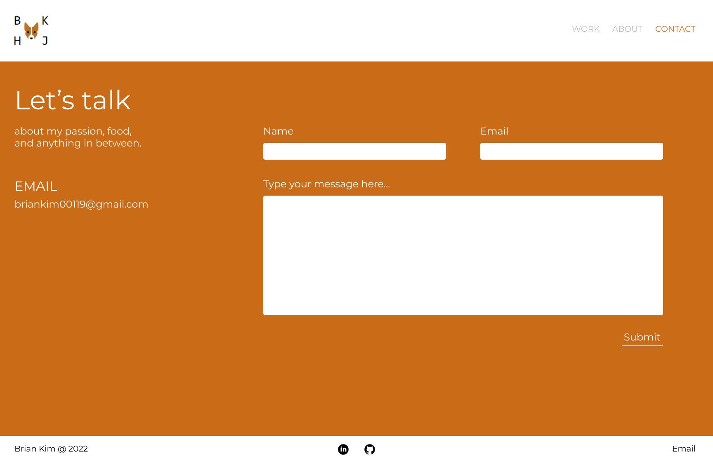
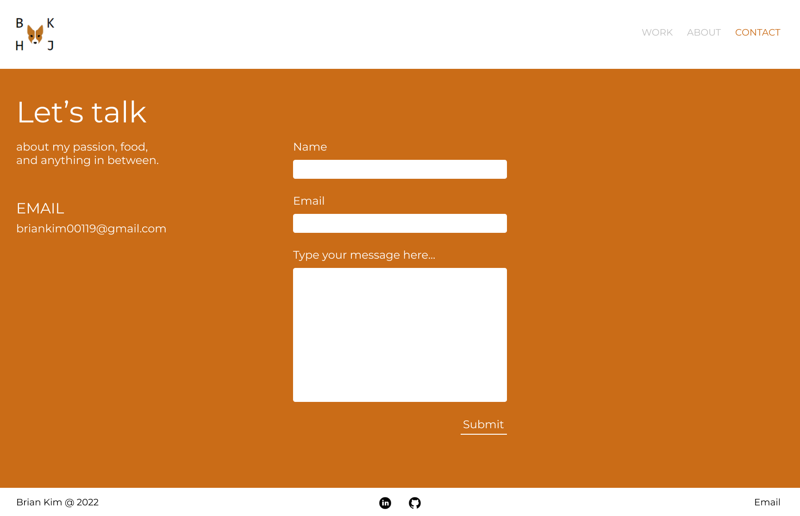

# Project 1: Contact Form for Portfolio Website
## Figma Prototype 1

## Figma Prototype 2

## Figma Prototype 3

## Contact Form Component
- Using React state management
- Formik - NPM package(https://www.npmjs.com/package/formik)
- Email using API from Netlify & Sendgrid to actually send email to me from something like no-reply@briankim.pro

## Knowns & Unknowns
### Knowns
- Overall Structure and the code itself

### Unknowns
- Optimal design that is user friendly